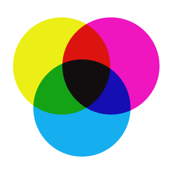

<h1 align="center">CMYK colourrrs</h1>

<p align="center">
  
</p>

<p align="center">
  <strong>CMYK colourrrs</strong> for Neovim is a dark colour theme.
</p>
<p align="center">
  by <a href="https://techygrrrl.stream">techygrrrl</a>
</p>

## Installation guide
You can install the theme with your preffered package manager:

Using [packer](https://github.com/wbthomason/packer.nvim)

```lua
use 'techygrrrl/techygrrrl-cmyk-colourrrs-neovim'
```

...or any manager you want

If you want to install it manually:

> Unix systems (mac/linux)
```bash
git clone https://github.com/techygrrrl/techygrrrl-cmyk-colourrrs-neovim \
  <your_nvim_runtime_path>
```

> Windows Powershell
```bash
git clone https://github.com/techygrrrl/techygrrrl-cmyk-colourrrs-neovim "<your_nvim_runtime_path>"
```

Enable colorscheme:

Lua:
```lua
vim.cmd [[colorscheme cmyk-colourrrs]]
```

Vim Script:
```vim
colorscheme cmyk-colourrrs
```

## Credits

Theme ported to Neovim by [@fadiinho](https://github.com/fadiinho)
